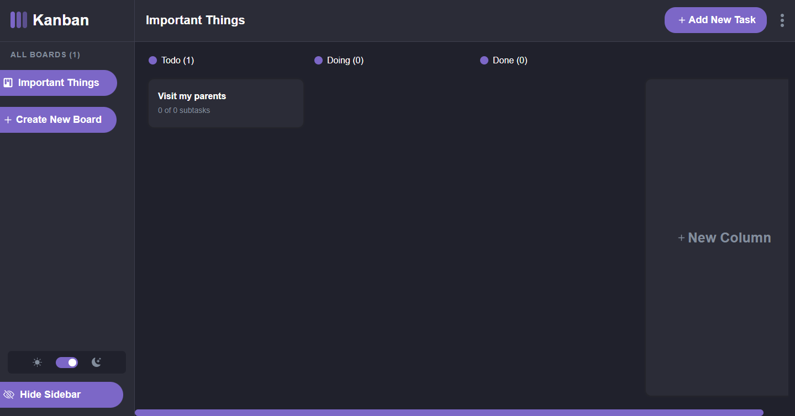

# Kanban Task

Welcome to **Kanban Task** project. It's a handy website that allows you to manage your tasks and make them come out of your mind. I used **HTML**, **SASS**, and **JavaScript** to make this app comes into existence. The objective of this website is that it allows you to create a new board, and add columns to that board like Todo, Doing, and so on. Then add your task to each column.

## Demo

You can enjoy the site at <https://kanban-task-46ir.onrender.com/>



## Credits

This app was created with by [Mohamed Aboubakr](https://www.linkedin.com/in/moaboubakr2001/ "LinkedIn Profile"). It uses the following technologies:

- HTML
- SASS
- JavaScript
- Webpack

## How to run the site locally?

If you want to run the site locally on your computer, follow these steps :

**1.** Clone the repository or download the ZIP file.

**2.** Run this command in the terminal to install all needed dependencies, after you check if you already have [NodeJs](https://nodejs.org/en) installed.

```bash
npm install
```

**3.** Then run this command to make [Webpack](https://webpack.js.org/) build the **Dist** folder (production folder)

```bash
npm run build
```

**4.** Then run this command to open the **live server** which will use the **Dist** folder as a reference to make the site works as intended.

```bash
npm run dev
```
